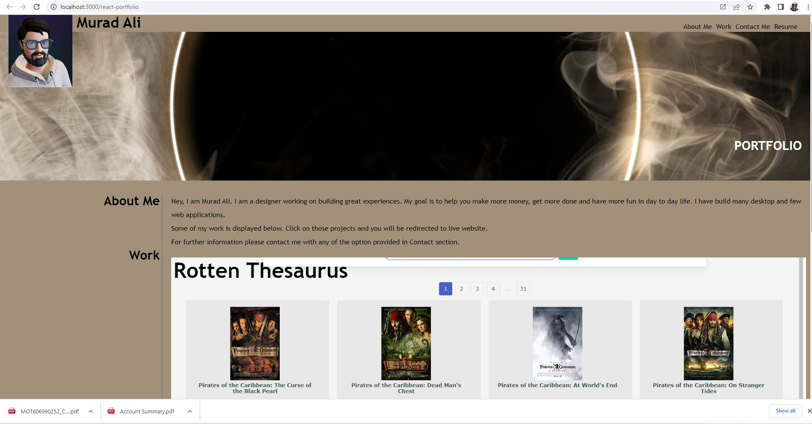
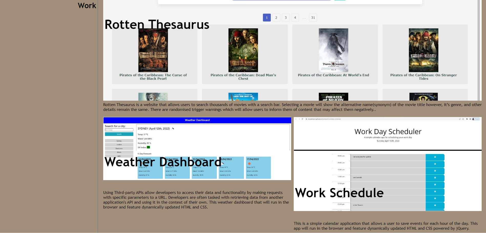

# React Portfolio

  

## Description

This portfolio is created using React basic skills.

## Heroku Deployment

https://muradmanni.github.io/react-portfolio/

## Table-of-Contents
* [Installation](#installation)
* [Usage](#usage)
* [URL (github repository)](#urlrepo)
* [License](#license)
* [Questions](#questions)

## Installation  

To install type

    npm install

This will install all the dependency modules.

    npm run build

This will build the package.

    npm run deploy

This will delopy the project to the web address mentioned in package.json on "homepage"

## Usage      
    npm start

To start the project, type the above command and server will start running.

## URL (github repository)

Following link is to access the code files using github repository.

https://github.com/muradmanni/react-portfolio

## [Screenshot](#screenshot)

## [License](#table-of-contents)
The application is covered under the following license: [MIT](https://choosealicense.com/licenses/mit/)

## [Questions](#table-of-contents)
Feel free to email at murad.manni@gmail.com, if you have any further questions relating to this project.

Checkout more on [Github](https://github.com/muradmanni)
---
© 2022 Murad Ali. All Rights Reserved.
